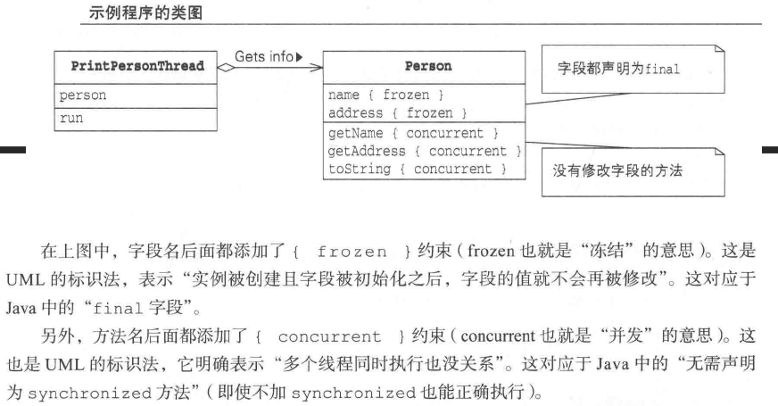
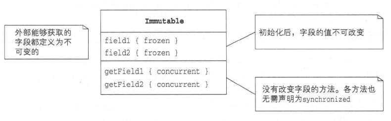
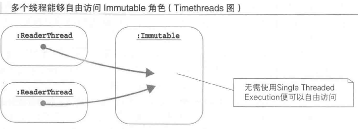
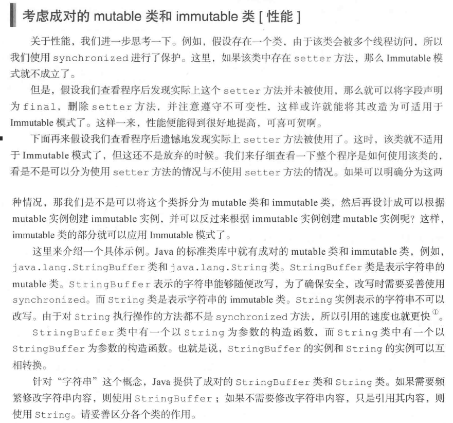
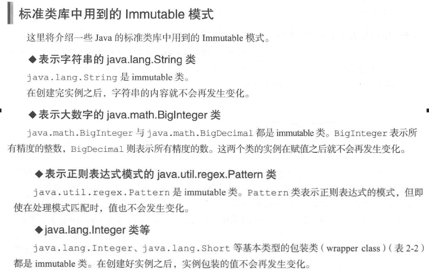
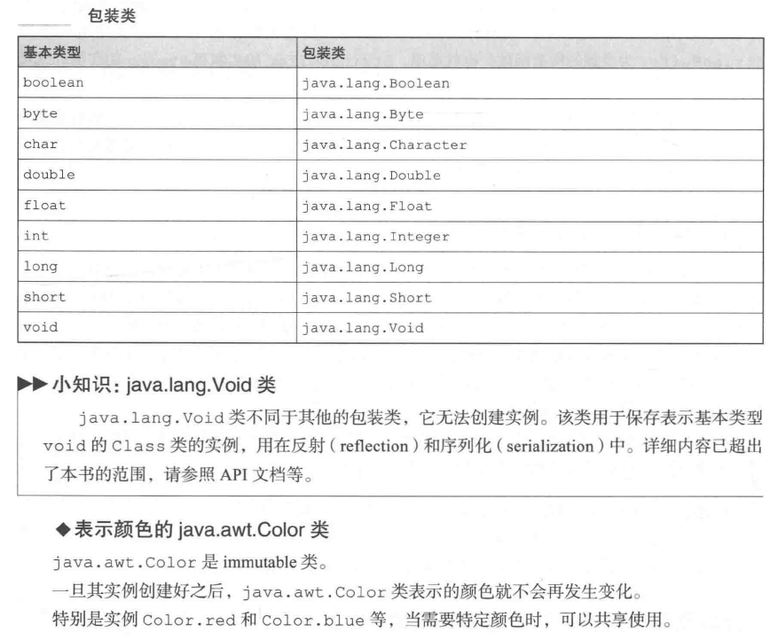

# Immutable:想破坏也破坏不了

该模式确保实例一旦创建完毕后,其内容便不可更改。
该模式下，由于实例不会不一致，所以无需执行互斥处理，程序性能也能提高。

## 解读

目的在不执行耗时的互斥操作下，不影响程序的安全性，一旦创建，即不改变，无论多少次访问都不会影响它以至于发生变化，以此来提升计算机的性能。

### 说明

- 事实上，并非所有的操作都需要提供互斥操作，例如：String就是一个一次生成，再也不会被改变的类。在实际生产过程中，存在着需要保存实例状态却不允许其他人改变它的情况,采用此模式,即可避免耗时的互斥操作,来提高计算机性能。 
- 例如我们浏览的淘宝页面，我们并不能对他进行修改，它们是由淘宝后台统一来进行修改的，我们只有浏览的权限，但是当别人与我们查看相同内容的时候，并不会因为我们的查看而导致其他人无法查看网页的相关内容。

## 关联

- Single Thread Execution:
- Read-Write Lock
- Flyweight(享元模式)

## 介绍

### Immutable模式：不需要执行耗时的互斥处理，利用此模式，能提升程序性

Immutable是不变的，不发生改变的。Immutable模式中存在着确保实例状态下不发生改变的类(immutable)类,在访问这些实例的时候
并不需要执行耗时的互斥处理,因此若能巧妙利用该模式,定能提高程序的性能.

### 例子

### 角色元素
#### Immutable的类

### 拓展使用

- 实例创建后,状态不再发生改变
- 实例是共享的,且被频繁访问: 因为该模式无需使用synchronized进行保护就能保证安全性和生存性. 所以当实例过多的时候, 且有可能频繁使用的时候,使用
该模式的优点就凸显出来.

### 性能思考

### 可复用性

### JDK

