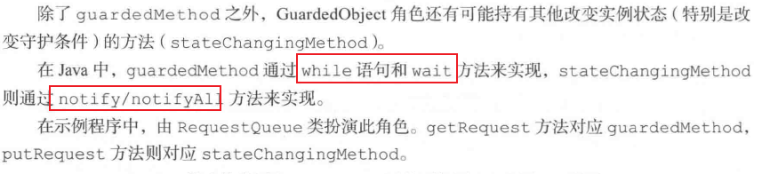

# Guarded Suspension: 等我准备好

该模式在实例进入目标状态之前,防止线程继续执行的模式。防止实例不一致。

## 解读

当我们收到线程通知时，让它暂时等待，等到了合适的时机再和他通讯，通过等待来保证线程的安全性。

### 说明

- 该模式比较复杂，需要用心阅读，配合使用场景去了解该模式

## 关联
- Single Thread Execution
- Balking
- Producer-Consumer
- Future
## 介绍

### xx模式模式

### 例子sample_01


#### getRequest详解
```
public synchronized Request getRequest(){
    while(queue.peek() == null){  //quue.peek() != null是守护条件
        try{
            wait();
        }catch(InterruptedException e){
        }
    }
    return queue.remove();
}

//

```
#### putRequest详解

#### synchronized在例子中的含义

#### wati和锁

### 角色元素
- 被守护的对象:Guarded Object

当线程执行guardedMethod方式时,若守护条件成立,则可以立即执行;当守护条件不成立时,就要进行等待.
守护条件的成立与否随着GuardedObject角色的状态不同而变化.




### 拓展使用
- 附件条件的synchronized
- 多线程版本的if
- 忘记改变状态与生存性
- wait 与 notify/notifyall的责任[可复用性]


### 生存性

### 可复用性

### JDK


