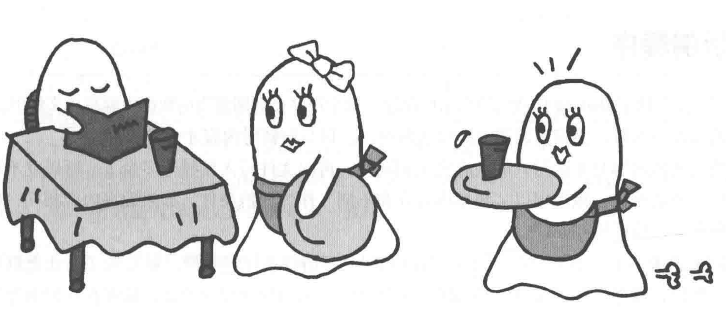
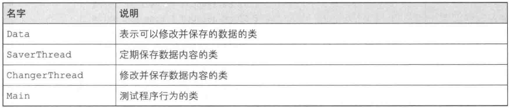
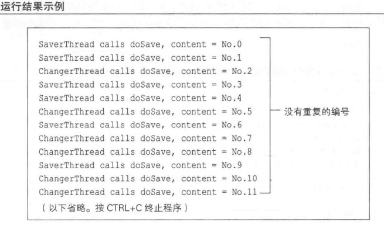
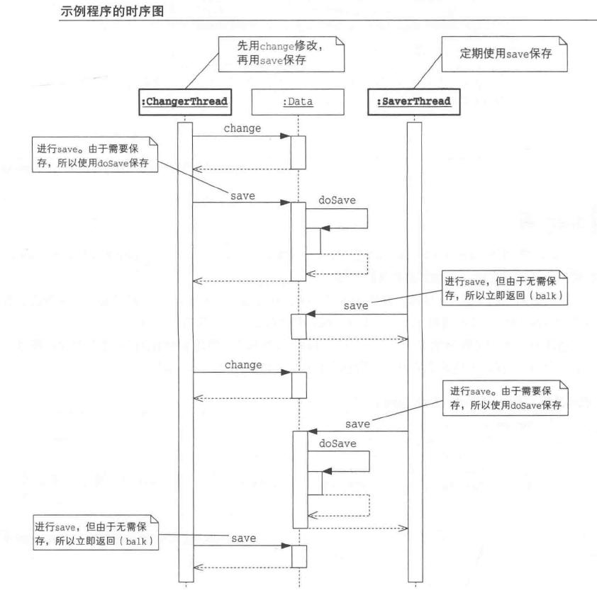
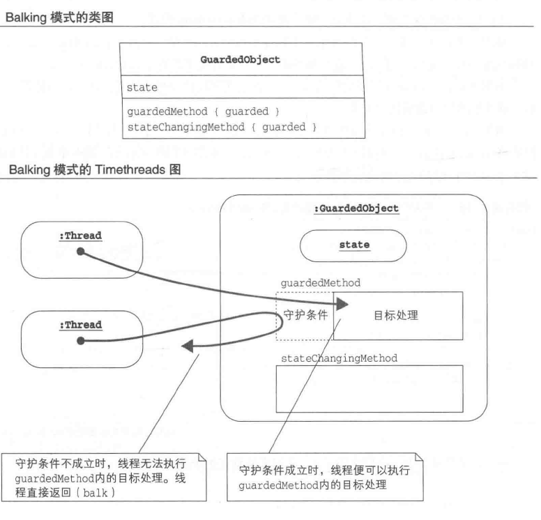

# Balking:不需要就算了

如果实例未进入目标状态,则中断方法执行的模式。

该模式可防止执行执行无效的等待和多余的方法。

## 解读

可以结合本章的场景去理解。你需要呼叫服务员，当服务员A响应并来到你的身边时，服务员B正准备来，可当服务员B看到A已经在的时候，服务员B看到A已经在的时候，服务员B就停止过来了。AB服务员就如同两个响应线程一样。

### 说明

多线程设计模式并非泛泛而谈，除了服务员的例子，我们身边还有很多诸如此类的例子，例如我常见的滴滴打车，不就是如此吗？当一个用户约到一辆车，即便其他的车子也接到了单子，但当用户已经约到车，其他的响应就会自动丢弃。

## 关联

## 介绍

### xx模式模式

### 例子_sample_01

### 角色元素

- GuardedObject(被防护的对象)

### 拓展使用

