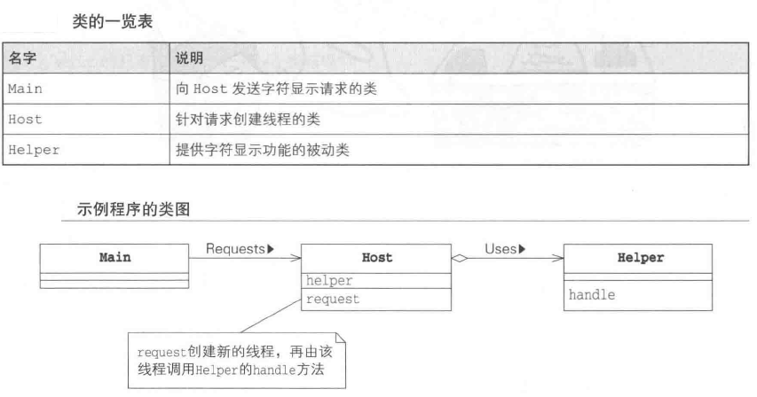
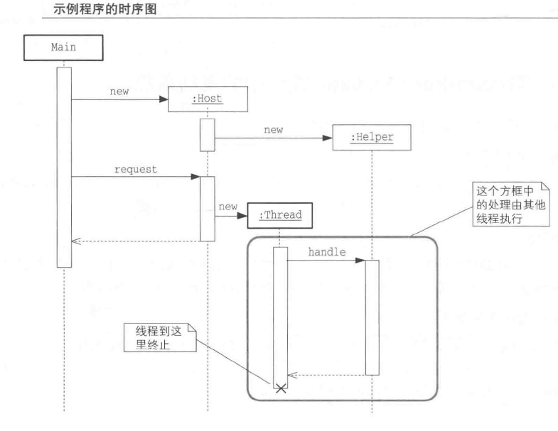
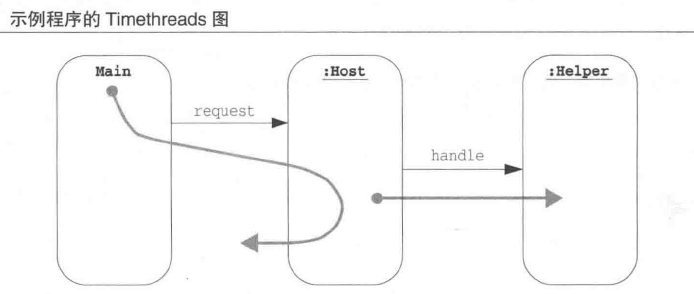
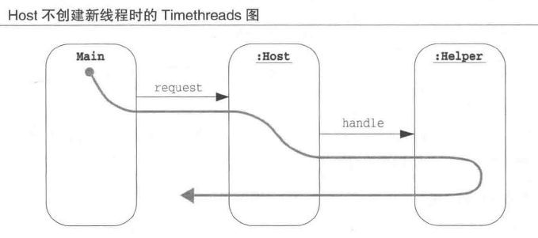

# Thread-Per-Message:这项工作就交给你

该模式将处理委托给其他线程。线程可以将任务委托给其他线程，自己则直接处理接下来的工作。
该模式能够提高程序的响应性。

## 解读

分为委托端与执行端的两个部分。

### 说明

- 比如，老板希望知道全国每个省的销售情况，他可以自己一个人去跑所有的省（如果他愿意）一般这样的情况不会发生，因为太
过于频繁也太过于浪费时间了。老板会委托很多人同时去各个身份调查，这样其他的人就可以并发地处理，节约大量的时间。

- 线程也是如此，如果单线程同步向数据库发起请求，假设一个请求需要5秒，依次发起8个请求的话，那用户就需要等待40秒，当如何同时
发起8次请求（创建线程的时间忽略不计），那么忽略其他因素，仅仅需要5秒即可响应客户了。

## 关联

## 介绍

### xx模式模式

### 例子-sample-01

### 角色元素

- Client(委托人)
- Host
- Helper(助手)

### 拓展使用

### 生存性

### 可复用性

### JDK