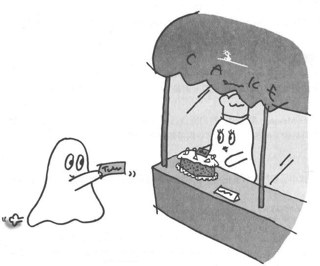

# Future模式: 先给您提货单

该模式下,可以同步获取交给其他线程的结果。
该模式适用于调用异步方法的情况。

## 解读

未来模式与任务委托模式类似，但不同的是，这个明确了主线程的参与，同时目的也不同，是委托别人去完成。重点不在于此，而在于我们不需要等待他人完成才进行下一步。

### 说明

- 倘若我们需要买一个蛋糕，你会到了蛋糕店才傻傻等待蛋糕做出来吗？
- 这时候，收银员给你一张票据，告诉你在未来的一段时间内，随时可以过来提取（约定好了时间，除非你希望哪个蛋糕一直放在他们的冰箱里）。这时候，
你便可以离开蛋糕店，去买一些红酒以及牛排，准备好今日的生日晚餐，待到黄昏时分，蛋糕也做完了，你带着票据去开开心心把蛋糕提走，过了一个愉快的夜晚。
-在面对一些IO密集型等待时间较长的操作的时候，我们可以先让别人去做，我们等到合适的时机再去取即可，不需要等待它完成才能进行下一步操作。

## 关联模式