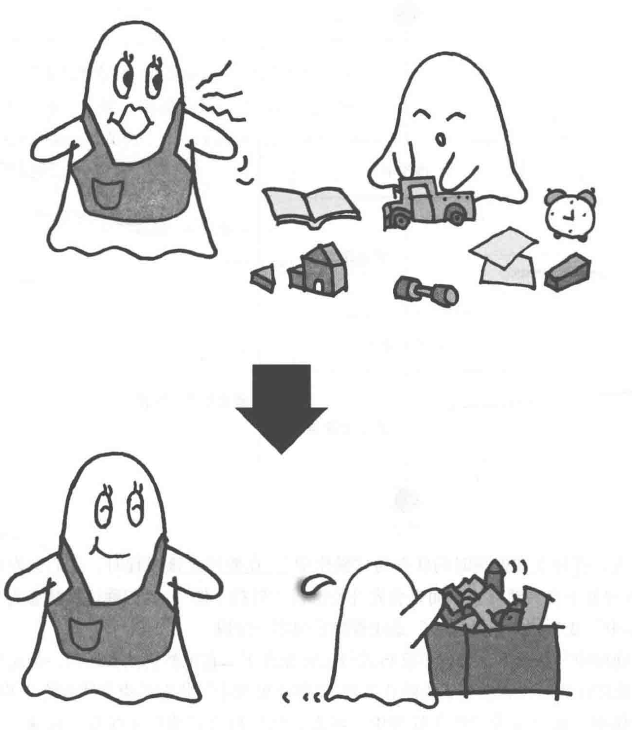

# Two-Phase-Termination模式: 先收拾房间在睡觉

该模式能够采用合适的终止处理来安全地终止线程。

## 解读

- 内容可以分为两个阶段终止模式。即当我们通知线程需要终止的时候，它会依据情况做一些预处理操作。

- 套用之前提到要点，需要做到

  - 安全地停止（安全性）
  - 必然会进行终止操作（生存性）
  - 发出请求后尽快进行终止处理（响应性）

### 说明

- 在此设计模式下，倘若我们希望结束线程，则可以执行一些我们所希望的操作，例如回滚，配合第4章节的停止并返回模式
是不是很好呢？假设我们已经发出请求不撤回消息，其他的线程不是直接中断请求（那样太不优雅），而是先给一个抱歉，并
撤回订单，然后在终止自己。是不是更加安全可靠呢？
- 而当已经通过的订单，我们希望终止，它就会在完成订单之后才终止进程。这样做优雅而且可靠，比起直接粗暴的强制停止
好太多。

## 关联模式