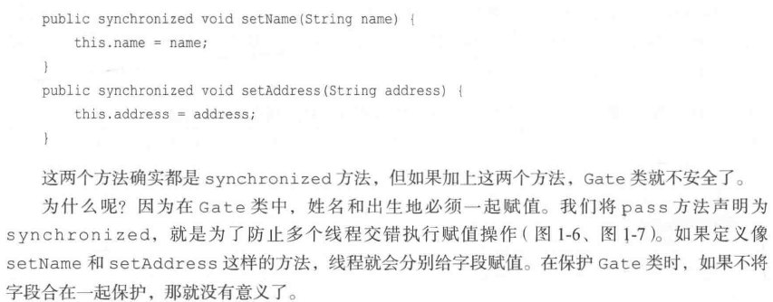

# 关于synchronized

## synchronized语法&Before/After模式

```
synchronized void method(){}

synchronized (obj){}
```

其实可以看做是“{”处获得锁，“}”处释放锁。

假设，存在一个获得锁的lock方法，或释放锁的unlock方法。
```
显示处理锁的方法：
void method(){
    lock();
    ...
    unlock();
}

如果在lock方法和unlock方法之间存在return，那么锁将无法被释放。
void method(){
    lock();
    if(条件表达式){
        return; //这里执行了return，unlock()就不会被调用。
    }
    unlock();
}

void method(){
    lock();
    doMethod(); //如果该方法抛出异常，unlock()就不会被调用
    unlock();
}
```
上述问题并不仅仅在于return语句，异常处理也存在这样的问题，调用的方法（或该方法调用的方法）
抛出异常时候，锁也就无法被释放。

避免异常导致的问题，必须使用finally语句
```
void method(){
    lock();
    try{
        ...
    }finally{
        unlock();
    }
}
```

## synchronized在保护什么

synchronized就像门上的锁。当你看到门上的锁时，我们还应该确认其他的门和窗户是不是都锁好了。
只要是访问多个线程共享的字段的方法，就需要使用synchronized进行保护。

## 该以什么单位来保护呢？

```java
public class Gate {
	//已经通过的人数
	private  int counter = 0;
	//最后一个通行者的“姓名”
	private String name = "Nodody";
	//最后一个通行者的出生地
	private String address = "Nowhere";
	
	/**
	 * 添加：synchronized
	 * 表示通过门
	 * @param myname
	 * @param myaddress
	 */
	public synchronized void pass(String myname, String myaddress) {
		this.counter++;
		this.name = name;
		try {
			Thread.sleep(1000);
		} catch (InterruptedException e) {
			e.printStackTrace();
		}
		this.address = address;
	}
}
```
比如上面的代码，已经在pass方法上加了synchronized方法。
如果set和get方法都同时加上synchronized并不能保证安全


## 原子操作

synchronized方法只允许一个线程同时执行。如果某个线程正在执行synchronized方法，
其他线程就无法进入该方法。也就是说，从多线程的角度来看，这个synchronized方法执行
的操作是“不可分割的操作”。这种不可分割的操作通常称为“原子atomic”操作。

atom是物理学中的“原子”，本意为不可分割的物体。

## long与double的操作不是原子的

Java中定义了一些原子的操作。
例如char，int等基本类型的赋值和引用都是原子的；引用类型的赋值和引用操作也是原子的。
因此，就算不使用synchronized也不会被分割。

例外：long和double的赋值和引用操作并不是原子的。
最简单的方法就是在synchronized方法中执行；或字段上加上volatile关键字。

总结：
- 基本类型，引用类型的赋值和引用是原子操作
- long和double的赋值和引用都是非原子操作
- long或double在线程间共享时，需要将其放入synchronized中操作，或声明为volatile。


