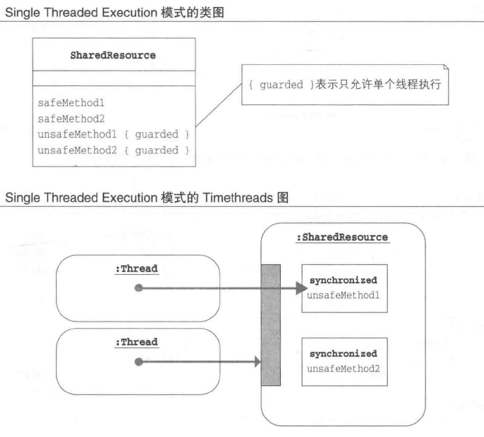
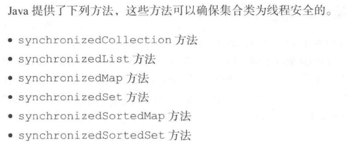
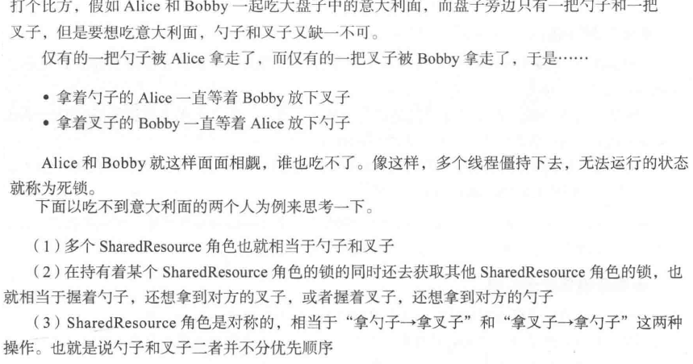
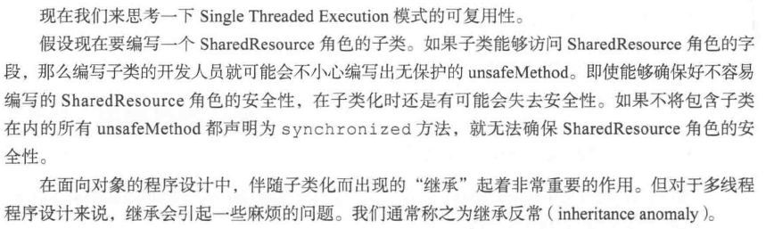

# Single Thread Execution:能通过这座桥的只有一个人

该模式可以确保执行处理的线程只能是一个,这样就可以有效防止实例不一致。

## 解读
单例线程执行设计模式，通过设计限制，以保证同一时间仅有一个线程可以运行。

学习不仅要知其然，也要知其所以然。
- 为什么要使用单例线程执行模式？
- 适用的场景有哪些呢？
  
    - 银行的区块操作：即便有多个人登录你的账号，也只能排队依次按照顺序一个一个来取款。

## 关联模式

- Guarded Suspension
- Read-Write Lock
- Immutable
- Thread-Specific Storage

## 模式介绍

### Single Threaded Execution模式是基础

就像独木桥同一时间只允许一个人通行,该模式用于设置限制,以确保同一时间内只能让一个线程执行处理。

该模式有时候也称为临界区（critical section）或临界域（critical region）。该叫法侧重于“人过的桥”。

Single Threaded Execution叫法侧重于“过桥的人”。

### 例子

### 角色元素

- 共享资源（Shared Resource）：比如例子中的Gate类

  - safeMethod： 多个线程同时调用也不会发生问题的方法
  - unsafeMethod：多个线程同时调用会发生问题，需要加以保护的。

### 拓展使用

在哪些情况下使用？

- 单线程：不需要使用
- 多线程：
  - 所有线程都是完全独立操作： 无需使用。
  - ShareResource角色可能被多个线程同时访问
  - 处理多线程的框架中，有时线程的独立性是由框架控制的。
- 状态可能发生改变的时：
  - 之所以使用该模式，是因为ShareResource角色的状态会变化。在创建实例之后，实例的状态再也
不变化就无需使用该模式。
- 为了确保安全：Java的集合类大多数都是非线程安全的。这是为了在不需要考虑安全性的时候考虑程序的运行速度。

### 生存性与死锁

在Single Threaded Execution模式发生死锁需要满足的条件：

- 存在多个SharedResource角色
- 线程在持有某个SharedResource角色的锁的同时，还想获得其他的SharedResource角色的锁
- 获得SharedResrouce角色的锁的顺序并不固定（SharedResource角色是相对的）

只要破坏上面3个条件中的一个，就可以防止死锁。

### 可复用性和继承反常

### 临界区的大小和性能

一般而言Single Threaded Execution会较低程序的性能。原因有以下两方面。
- 获取锁需要花费时间
- 线程冲突引起的等待：其他线程想进入临界区就会面临阻塞，需要等待。等待的时长越长，性能越低。

### JDK

即使有类似功能的类库，也会存在易于发生线程冲突的区别。
java.util.Hashtable和java.util.concurrent.ConcurrentHashMap功能类似,都是线程安全的类。
- Hashtable中的所有方法都采用Single Threaded Execution模式；
- ConcurrentHashMap则将内部数据结构分成多段，针对各段的线程互不相干，因而也就无需针对其他线程执行互斥处理。
这样看来，Hashtable更容易发生线程冲突。

但是，实际性能和运行环境也密切相关。并非任何情况下ConcurrentHashMap就一定是有利的。

