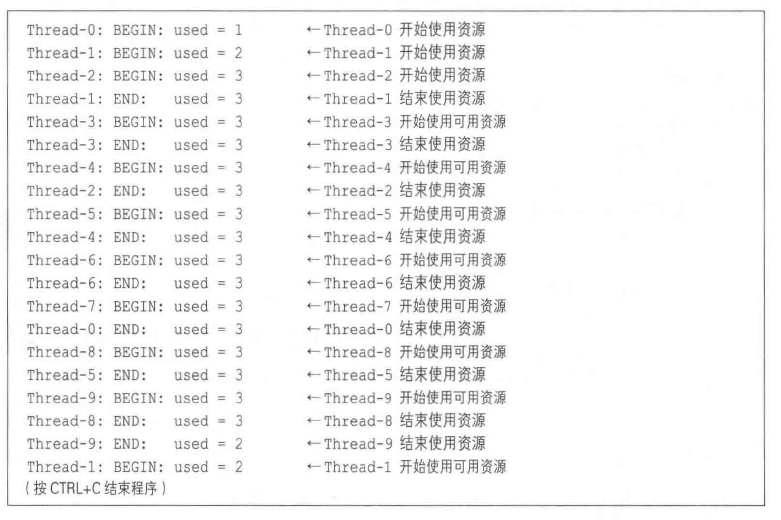

# java.util.concurrent包和计数信号量

## 计数信号量和Semaphore类

Single Threaded Execution模式用于确保某个区域“只能有一个线程”执行。下面我们将这种模式扩展。确保某个区域“最多只能由N个线程”
执行。这时就要用计数信号量来控制线程数量。

假设能够使用的资源个数为N个，而需要这些资源的线程个数又多于N个。此时就会导致竞态。

java.util.concurrent包中提供了表示信号量的Semaphore类。

资源的许可个数（permits）将通过Semaphore的构造函数来指定。

Semaphore的acquire方法用于确保存在可用资源。当存在可用资源的时候，线程会立即从acquire方法返回，同时信号量内部的资源
个数会减1。如果没有可用资源，线程则阻塞在acquire方法内，知道出现可用资源。

Semaphore的release方法用于释放资源。释放资源后，信号量内部的资源个数会增加1。另外，如果acquire中存在等待的线程，那么其中一个线程
会被唤醒，并从acquire方法返回。

## 使用Semaphore类的示例程序
[使用例子](../src/demo_semaphore/Main.java)

