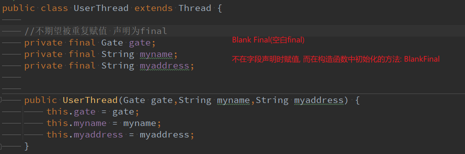

## 巧妙性
编写多线程的时候,如何能够巧妙将线程的互斥机制和方法隐藏到类中。





## 无限循环

```
    //无限循环进行添加和删除操作
    for (int i = 0; true; i++) {
        list.add(i);
        list.remove(0);
    }
    
    //
    while(true){
    }
```

## 异常处理

异常不过是调查Bug根本原因时的提示而已，所以编写程序的时候并不能依赖于抛出的异常。
